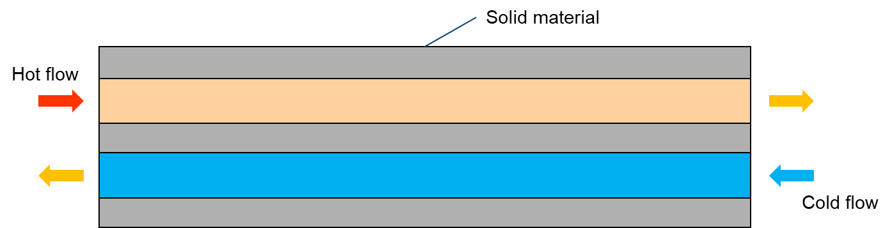

# Conjugate heat transfer

Conjugate heat transfer (CHT) is a term used to describe the simultaneous transfer of heat between a fluid and a solid. This process is commonly found in engineering applications involving heat exchangers, electronic cooling systems, and combustion engines.

In CHT, fluid flow and heat transfer are coupled together, meaning that the temperature of the solid affects the temperature of the fluid, and vice versa. To accurately model CHT, it is necessary to use computational fluid dynamics (CFD) software that can simulate both fluid flow and heat transfer. One key challenge in CHT modeling is the accurate representation of the solid boundary. The temperature distribution at the boundary affects the heat transfer between the fluid and the solid, and must be modeled carefully to ensure accurate results.

<div align="center">
  
</div>

In modeling heat transfer, the following components and aspects are considered:

- main
  - Temperature distribution
- hot (fluid)
  - Single-phase flow
  - Temperature distribution (mapped from main)
- cold (fluid)
  - Single-phase flow
  - Temperature distribution (mapped from main)
- solid (solid)
  - Temperature distribution (mapped from main)

```note
    In the current implementation, the temperature equation is solved implicitly. This approach  accelerates convergence when compared to the chtMultiRegionSimpleFoam solver.
```

If you encounter difficulties with convergence:
- First, check the quality of your mesh.
- Adjust (decrease) the equation relaxation factors in fvSolution, for instance, in system/fuel/fvSolution.