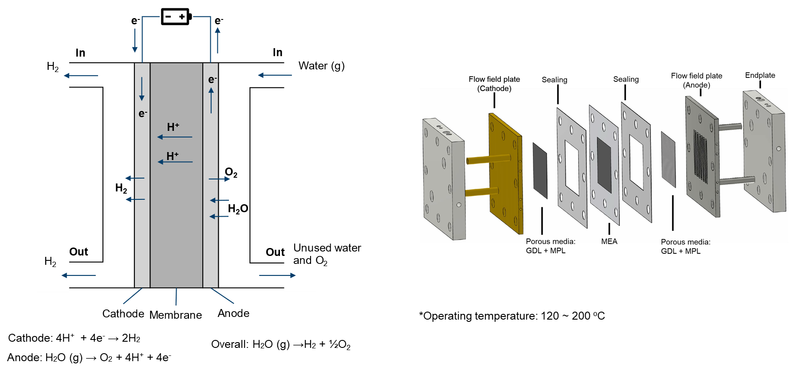

# High-temperature proton exchange membrane electrolyzer

A high-temperature proton exchange membrane electrolyzer is a device that utilizes electrical energy to split water into hydrogen and oxygen at temperatures up to 200°C. Compared to traditional electrolyzers, high-temperature proton exchange membrane electrolyzers have faster reactions and higher conversion efficiency, making them more energy-efficient. They can also produce high-purity hydrogen, which is crucial for fuel cells. Although still in development, high-temperature proton exchange membrane electrolyzers show promise as a more efficient and effective method for producing hydrogen.

<div align="center">
  
</div>

In modeling the physical processes within a HTPEMEC, the following components and aspects are considered:

- main
  - Temperature distribution
- air (fluid)
  - Electrochemical reaction
  - Single-phase flow
  - Multicomponenet species
  - Temperature distribution (mapped from main)
- fuel (fluid)
  - Electrochemical reaction
  - Single-phase flow
  - Multicomponent species transfer
  - Temperature distribution (mapped from main)
- phiEC (electric)
  - Electron transfer
  - Temperature distribution (mapped from main)
- phiEA (electric)
  - Electron transfer
  - Temperature distribution (mapped from main)
- phiI (electric)
  - Proton transfer
  - Temperature distribution (mapped from main)
- electrolyte (solid)
  - Temperature distribution (mapped from main)
- interconnect (solid)
  - Temperature distribution (mapped from main)

Given the high operating temperature (100 ~ 200°C), it is typically assumed that water exists as water vapor. The flow at both sides are treated as single-phase flows.

```note
    In HT-PEMECs, a commonly used membrane is based on Polybenzimidazole (PBI). The electrical conductivity of this membrane is dependent on the level of phosphoric acid doping. For simplicity in modeling, a constant electrical conductivity is assumed.

    On the fuel side, pure hydrogen can be used for the gas flow. You can turn off the species solution by adding 'Y  false;' in PIMPLE dictionary of system/fuel/fvSolution.
```

If you encounter difficulties with convergence:
- First, check the quality of your mesh.
- Adjust (decrease) the equation relaxation factors in fvSolution, for instance, in system/fuel/fvSolution.
- Tweak (decrease) the relaxation factors in constant/(air or fuel)/combustionProperties.
- Modify (decrease) the relaxation factors in constant/phiI/regionProperties.
- Make adjustments (decrease) to the relaxation factors in constant/phiEC/regionProperties.