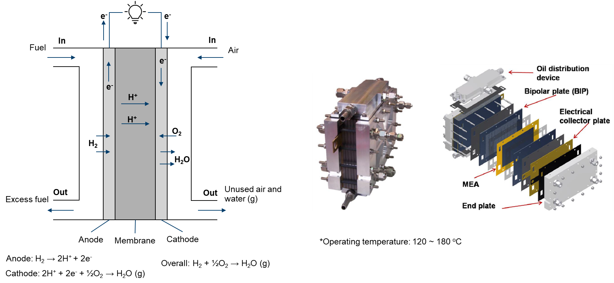

# High-temperature proton exchange membrane fuel cell

High-temperature proton exchange membrane fuel cells (HTPEMFCs) offer a promising alternative to conventional PEMFCs, with several advantages including increased power density, improved tolerance to impurities, and reduced catalyst loading. HT-PEMFCs operate at temperatures above 100°C, allowing for faster reaction kinetics and more efficient power output. Additionally, HT-PEMFCs can tolerate impurities such as CO and methanol, making them ideal for use in fuel cell vehicles and portable power applications. The use of non-precious metal catalysts in HT-PEMFCs also helps to reduce costs, making them more economically viable. Ongoing research and development of HT-PEMFCs has the potential to make them a key technology in the transition to a more sustainable and carbon-neutral energy system.

<div align="center">
  
</div>

CFD modeling enables engineers and researchers to simulate and visualize the intricate flow of reactants (hydrogen and air) and products (water vapor) within the HTPEMFC. It helps optimize the design of flow channels, ensuring uniform distribution and minimizing pressure drops, which can improve overall cell performance.

In modeling the physical processes within a HTPEMFC, the following components and aspects are considered:

- main
  - Temperature distribution
- air (fluid)
  - Electrochemical reaction
  - Single-phase flow
  - Multicomponenet species
  - Temperature distribution (mapped from main)
- fuel (fluid)
  - Electrochemical reaction
  - Single-phase flow
  - Multicomponent species transfer
  - Temperature distribution (mapped from main)
- phiEC (electric)
  - Electron transfer
  - Temperature distribution (mapped from main)
- phiEA (electric)
  - Electron transfer
  - Temperature distribution (mapped from main)
- phiI (electric)
  - Proton transfer
  - Temperature distribution (mapped from main)
- electrolyte (solid)
  - Temperature distribution (mapped from main)
- interconnect (solid)
  - Temperature distribution (mapped from main)

Given the high operating temperature (120 ~ 180°C), it is typically assumed that water exists as water vapor. The flow at both sides are treated as single-phase flows.

```note
    In HT-PEMFCs, a commonly used membrane is based on Polybenzimidazole (PBI). The electrical conductivity of this membrane is dependent on the level of phosphoric acid doping. For simplicity in modeling, a constant electrical conductivity is assumed.

    On the fuel side, pure hydrogen can be used for the gas flow. You can turn off the species solution by adding 'Y  false;' in PIMPLE dictionary of system/fuel/fvSolution.
```

If you encounter difficulties with convergence:
- First, check the quality of your mesh.
- Adjust (decrease) the equation relaxation factors in fvSolution, for instance, in system/fuel/fvSolution.
- Tweak (decrease) the relaxation factors in constant/(air or fuel)/combustionProperties.
- Modify (decrease) the relaxation factors in constant/phiI/regionProperties.
- Make adjustments (decrease) to the relaxation factors in constant/phiEC/regionProperties.
