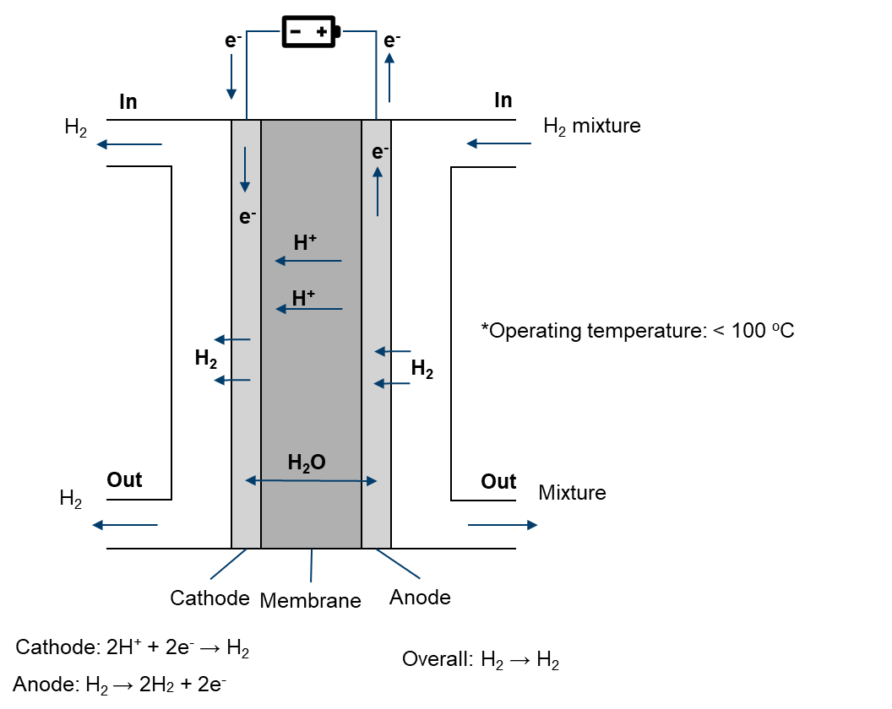

# Hydrogen pump

Hydrogen has been identified as a promising alternative to fossil fuels due to its high energy content and lack of harmful emissions. However, before it can be used as a fuel source, it must be purified to remove impurities such as carbon monoxide and sulfur compounds. This is where the hydrogen pump comes in.

The hydrogen pump is an electrochemical device that uses a proton exchange membrane (PEM) to purify hydrogen gas. The device works by passing hydrogen gas through the PEM, which selectively allows protons to pass through while blocking other gas molecules. This results in a stream of purified hydrogen gas that can be used for a variety of applications.

One of the key advantages of the hydrogen pump is its ability to operate at low temperatures and pressures. This makes it an ideal solution for purifying hydrogen gas in a variety of settings, including fuel cell vehicles and hydrogen fueling stations. Additionally, the hydrogen pump is highly efficient and can purify hydrogen gas to a high degree of purity with minimal energy input.

The development of the hydrogen pump is an important step in the transition to a hydrogen-based economy. With its ability to purify hydrogen gas with high efficiency and minimal energy input, the hydrogen pump has the potential to revolutionize the way we produce and use hydrogen as a fuel source.

<div align="center">
  
</div>

In modeling the physical processes within a electrochemical hydrogen pump, the following components and aspects are considered:

- main
  - Temperature distribution
- air (fluid)
  - Electrochemical reaction
  - Single-phase flow
  - Multicomponenet species
  - Temperature distribution (mapped from main)
- fuel (fluid)
  - Electrochemical reaction
  - Single-phase flow
  - Multicomponent species transfer
  - Temperature distribution (mapped from main)
- phiEC (electric)
  - Electron transfer
  - Temperature distribution (mapped from main)
- phiEA (electric)
  - Electron transfer
  - Temperature distribution (mapped from main)
- phiI (electric)
  - Proton transfer
  - Dissolved water transfer
  - Temperature distribution (mapped from main)
- electrolyte (solid)
  - Temperature distribution (mapped from main)
- interconnect (solid)
  - Temperature distribution (mapped from main)

```note
    The electrochemical hydrogen pump typically utilizes a proton exchange membrane that conducts protons and allows the permeation of dissolved water. This crucial component operates at temperatures below 100°C. Due to the typically low water concentration, the flow is simplistically assumed to be single-phase.
```

If you encounter difficulties with convergence:
- First, check the quality of your mesh.
- Adjust (decrease) the equation relaxation factors in fvSolution, for instance, in system/fuel/fvSolution.
- Tweak (decrease) the relaxation factors in constant/(air or fuel)/combustionProperties.
- Modify (decrease) the relaxation factors in constant/phiI/regionProperties.
- Make adjustments (decrease) to the relaxation factors in constant/phiEC/regionProperties.