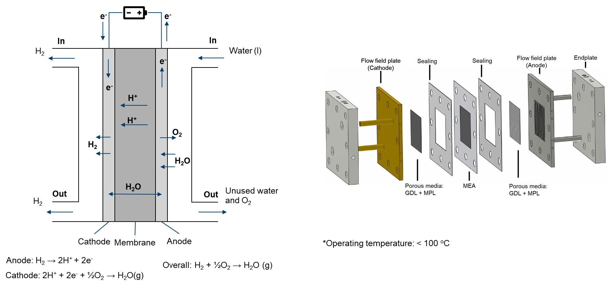

# Proton exchange membrane electrolyzer

Proton exchange membrane (PEM) water electrolyzers are devices that use an electric current to separate water into hydrogen and oxygen molecules. This process occurs in a cell with an anode and cathode, which are divided by a PEM, a selectively permeable membrane that only allows positively charged protons to pass through to the cathode.

PEM electrolyzers are highly efficient, producing high-purity hydrogen with minimal energy consumption. They are widely used in industrial processes and are being explored as a way to produce hydrogen for fuel cell vehicles. PEM electrolyzers offer several advantages over traditional electrolyzers, including higher efficiency, lower operating temperatures, and faster response times.

PEM electrolyzers have become increasingly popular in recent years due to the growing interest in renewable energy sources and the need to reduce greenhouse gas emissions. They are seen as an important element in the transition to a more sustainable future. PEM electrolyzers can be powered by various renewable energy sources, such as solar and wind power, making them a key component in the development of a green hydrogen economy.

<div align="center">
  
</div>

One of the primary challenges in optimizing PEMEC is understanding the intricate fluid dynamics within these devices. CFD modeling allows engineers to simulate and visualize the flow of water, reactant gases, and product gases within the various compartments of the electrolyzer. This insight is invaluable for designing efficient flow patterns that maximize the interaction between the reactants and the membrane while minimizing energy losses.

While CFD modeling holds immense promise for optimizing PEMECs, challenges remain. Modeling complex multiphase flow, addressing material properties, and achieving high-fidelity simulations are ongoing research areas. Future developments in CFD techniques, coupled with experimental validation, will continue to drive advancements in PEMEC technology.

When modeling the intricate physical processes within a Proton Exchange Membrane Water Electrolyzer (PEMEC), a comprehensive consideration of various components and factors is essential:

- main
  - Temperature distribution
- air (fluid)
  - Electrochemical reaction
  - Two-phase flow
  - Multicomponenet species
  - Liquid water heat transfer
  - Gas phase temperature distribution (mapped from main)
- fuel (fluid)
  - Electrochemical reaction
  - Single-phase flow
  - Multicomponent species transfer
  - Temperature distribution (mapped from main)
- phiEC (electric)
  - Electron transfer
  - Temperature distribution (mapped from main)
- phiEA (electric)
  - Electron transfer
  - Temperature distribution (mapped from main)
- phiI (electric)
  - Proton transfer
  - Dissolved water transfer
  - Temperature distribution (mapped from main)
- electrolyte (solid)
  - Temperature distribution (mapped from main)
- interconnect (solid)
  - Temperature distribution (mapped from main)

Given the relatively low operating temperature (< 100°C) of PEMECs, they operate with liquid water as the primary reactant, yielding hydrogen and oxygen as products. In this context, it's important to recognize that water can exist in both liquid and gaseous phases within PEMECs. As the water is supplied at the anode side, the flow on the cathode side is simplified to a single-phase.

When dealing with two-phase flow at the anode side,
- Flow within porous zones is governed by capillary pressure, characterized by the Leverett J function.
- Flow within void channels is mathematically modeled using a two-phase Euler-Euler solution algorithm.
- Heat transfer within the gas phase is accounted for by the main mesh, while the enthalpy equation of liquid water is specifically solved within the air region.
- The occurrence of evaporation and condensation is contingent on the saturation pressure of water vapor.

```note
    The solution of two-phase flow in the current implementation presents challenges in terms of convergence speed. We are open to alternative solution algorithms, such as the mixture model.

    A driftFluxSystem is also implemented, but it is still under development.

    If you have suggestions, please feel free to contact us.
```

If you encounter difficulties with convergence:
- First, check the quality of your mesh.
- Adjust the local time stepping (LTS) maxCo in constant/air/regionProperties
- Adjust (decrease) the equation relaxation factors in fvSolution, for instance, in system/fuel/fvSolution.
- Tweak (decrease) the relaxation factors in constant/(air or fuel)/combustionProperties.
- Modify (decrease) the relaxation factors in constant/phiI/regionProperties.
- Make adjustments (decrease) to the relaxation factors in constant/phiEC/regionProperties.