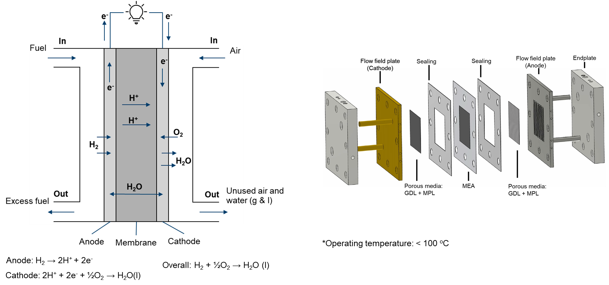

# Proton exchange membrane fuel cell

The proton exchange membrane (PEM) fuel cell is a type of electrochemical cell that generates electrical energy from the chemical energy of hydrogen and oxygen. It uses a polymer material as an electrolyte that separates the anode and cathode compartments of the fuel cell, allowing positively charged hydrogen ions to pass through while blocking negatively charged ions.

One of the most significant advantages of PEM fuel cells is their high efficiency and clean energy output. The electrochemical reaction that occurs in the fuel cell is more efficient than traditional combustion processes, with water being the only byproduct.

PEM fuel cells find use in various applications, including electric vehicles, backup power systems, and portable electronics. In electric vehicles, PEM fuel cells are used as range extenders to provide additional power when the battery is depleted. In backup power systems, they provide reliable and continuous power for critical applications such as hospitals and data centers. For portable electronics, PEM fuel cells provide longer-lasting and more reliable power than traditional batteries.

<div align="center">
  
</div>

CFD modeling serves as a potent tool for simulating and visualizing the intricate fluid flow, heat transfer, and mass transport phenomena within Proton Exchange Membrane Fuel Cells (PEMFCs). By harnessing CFD capabilities, researchers and engineers can acquire invaluable insights into the internal processes, facilitating design improvements, increased efficiency, and the sustainable utilization of PEMFCs.

In modeling the physical processes within a PEMFC, the following components and aspects are considered:

- main
  - Temperature distribution
- air (fluid)
  - Electrochemical reaction
  - Two-phase flow
  - Multicomponenet species
  - Liquid water heat transfer
  - Gas phase temperature distribution (mapped from main)
- fuel (fluid)
  - Electrochemical reaction
  - Single-phase flow
  - Multicomponent species transfer
  - Temperature distribution (mapped from main)
- phiEC (electric)
  - Electron transfer
  - Temperature distribution (mapped from main)
- phiEA (electric)
  - Electron transfer
  - Temperature distribution (mapped from main)
- phiI (electric)
  - Proton transfer
  - Dissolved water transfer
  - Temperature distribution (mapped from main)
- electrolyte (solid)
  - Temperature distribution (mapped from main)
- interconnect (solid)
  - Temperature distribution (mapped from main)

Given the low operating temperature (< 100°C), it is typically assumed that water is produced in the liquid phase. However, it's important to note that water can exist in both liquid and gas phases within PEMFCs. Since water is primarily produced at the cathode side, the flow at the anode side is simplified as single-phase.

For the two-phase flow at the cathode side, several considerations apply:
- Flow in the porous zone is driven by capillary pressure, described by a Leverett J function.
- Flow in void channels is modeled using a two-phase Euler-Euler solution algorithm, treating the gas phase as the continuous phase and the liquid water as the dispersed phase.
- Heat transfer of the continuous phase is considered by the main mesh, while the enthalpy equation of the dispersed phase is solved in the air region.
- Evaporation and condensation occur based on the saturation pressure of water vapor.

```note
  The solution of two-phase flow in the current implementation presents challenges in terms of convergence speed. We are open to alternative solution algorithms, such as the mixture model.
  
  A driftFluxSystem is also implemented, but it is still under development.

  If you have suggestions, please feel free to contact us.
```

If you encounter difficulties with convergence:
- First, check the quality of your mesh.
- Consider switching the default `ddt` in system/air/fvScheme from `steadyState` to `localEuler` or `Euler`. 
- Adjust (decrease) the equation relaxation factors in fvSolution, for instance, in system/fuel/fvSolution.
- Tweak (decrease) the relaxation factors in constant/(air or fuel)/combustionProperties.
- Modify (decrease) the relaxation factors in constant/phiI/regionProperties.
- Make adjustments (decrease) to the relaxation factors in constant/phiEC/regionProperties.