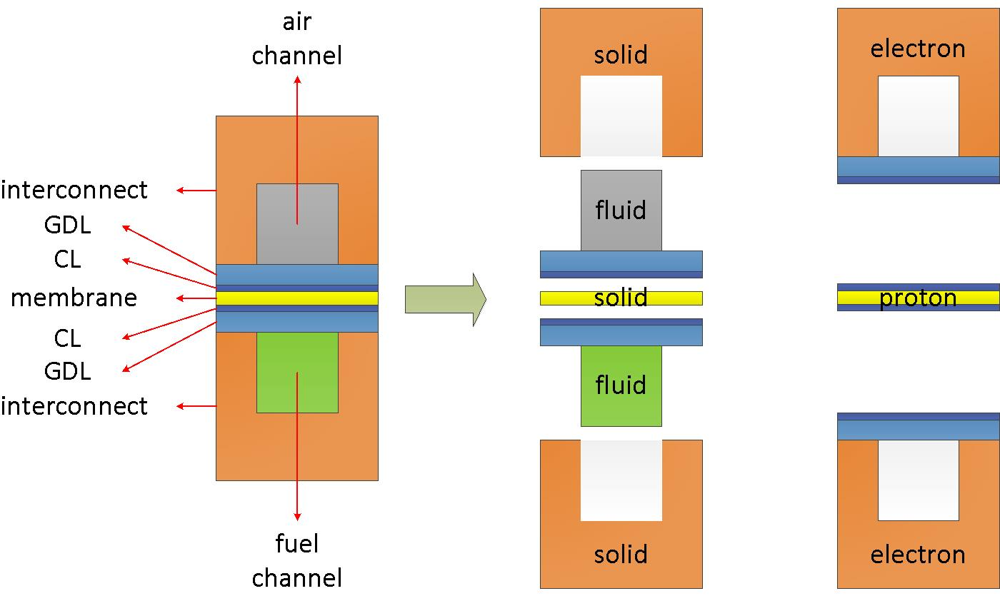
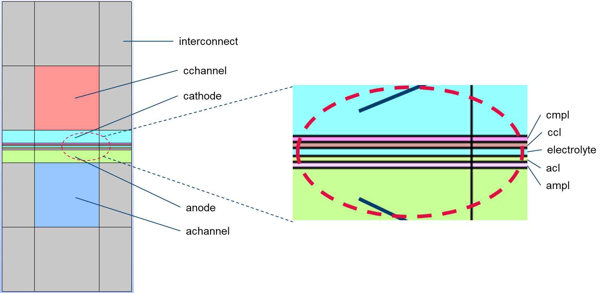
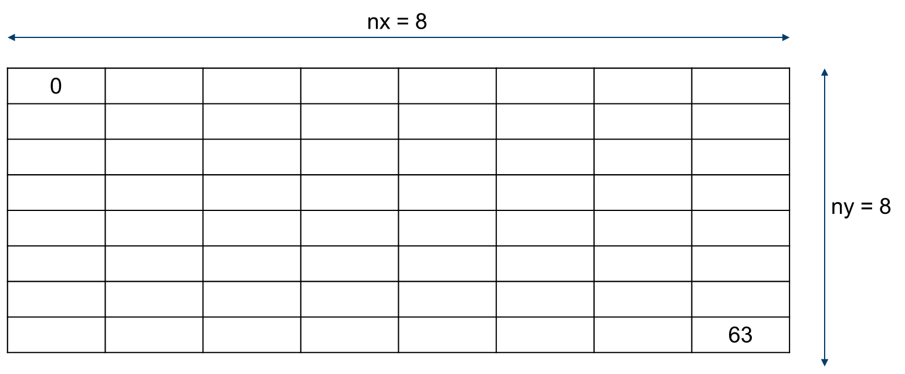

# Tutorials Guide

## General structure

Consider the cross-section of a fuel cell as an example. The computational domain provides:

<div align="center">
  
</div>

In a PEM fuel cell or other types, there are typically several regions or zones: air, fuel, electrolyte (membrane), and interconnect (bipolate or monoplate). You can find more information about this on the [openFuelCell](<http://openfuelcell.sourceforge.net/>) repository. However, additional regions such as phiEA, phiEC, and phiI are also necessary to account for electron, ion, and dissolved water transfer.

To consider the coupling transfer problems in a fuel cell, a parent mesh (main region) and several child meshes (local regions) are used. In the main region, the global energy/enthalpy equation is solved, while in the local regions, corresponding partial differential equations are discretized and solved. During simulation, material properties such as density and thermal conductivity are mapped from local regions to the global region, while the temperature field is mapped from the global region to the local regions.

The local regions can be classified into three different types: fluid, solid, and electric regions. Refer to `/src/libSrc/fuelCellSystems/regions` for more details.

- Fluid region:

  This region represents the space where fluid flows. In a fuel cell or electrolyzer, it consists of gas channels and/or porous zones. The following processes are addressed in this region:

  - Fluid flow (single/two phase)
  - Species transfer
  - Electrochemical reaction
  - Heat and mass transfers

  For example, in a fuel cell, the following parts apply to this region,

  - Air/fuel flow paths + diffusion layer + electrodes
  - Cooling channels

  ---

- Solid region:

  This represents the solid components in a fuel cell or electrolyzer. In the current framework, no equations will be solved here. However, stress analysis during assembly and thermal effects may be implemented for future applications.

  For example. in a fuel cell, the following components apply to this region,

  - Electrolyte/membrane
  - Interconnect/Bipolar-plate
  - Endplate

  ---

- Electric region:

  This region accounts for the electric-conductive components. It is designed to consider electron/ion transfer specifically. However, it is found that dissolved water takes place along with the region where proton transfer transfer takes place. Therefore, a switcher is enabled in the code to turn on/off the dissolved water transfer model. The following equations will be solved:

  - Potential equations (Possion equations)
  - Dissolved water transfer equations (diffusion and electro-osmotic-drag)

  For example, in a fuel cell, the following components belong to this region:

  - Bipolar-plate, GDL, MPL, CL -> electron transfer regions
  - Catalyst coated membrane, CCM, -> ion transfer and dissolved water transfer region

  ---

- main region:

  The heat source/sinks in local regions will be mapped to this region, and the obtained temperature is mapped back to the local regions. The heat source/sink includes:

  - Joule heat from the electric regions.
  - Condensation/evaporation in the fluid regions.
  - Electrochemical reactions in the fluid regions.

### How to mesh

You have the freedom to choose any meshing tool, as long as it can reproduce mesh files in OpenFOAM format. In our test tutorials, you can utilize either `make mesh` or `make salomeMesh` to access the built-in meshers, blockMesh or salome, respectively. These will help you create the initial mesh and run pre-processing scripts to generate the required primary and sub-region meshes.

If you opt for using other meshing tools, it is recommended to name sub-domains (or zones/regions) as illustrated in the figure below:

<div align="center">
  
</div>

- interconnect : the solid regions
- cchannel : channels at the cathode side
- cathode : cathode porous layer
- cmpl : cathode micro porous layer
- ccl : cathode catalyst layer (electrode)
- electrolyte : the ion-conducting electrolyte/membrane
- acl : anode catalyst layer (electrode)
- ampl : anode micro porous layer
- anode : anode porous layer
- achannel : channels at the anode side

```note
  If a zone is not present in your geometry, you must remove all references to it from several files: system/topoSetDict.*, system/(air, fuel, phiEC, phiEA, phiI)/topoSetDict, constant/(air or fuel)/porousZones, constant/(air or fuel)/diffusivityModel, and constant/(phiEC, phiEA, phiI)/regionProperties.

If you have additional regions, such as cooling channels, follow the same naming convention as fluid regions, like air or fuel. 
  
  These named zones are not hard coded into the source code. These names simplify the preprocessing steps.
```

### Creation of the meshes

The mesh generation process originates from the openFuelCell project and involves two sets of meshes: the main (parent) mesh and sub (child) meshes. Sub-meshes are closely linked to the main mesh. In each sub-mesh, several polyMesh files, `cellRegionAddressing`, `faceRegionAddressing`, `boundaryRegionAddressing`, and `pointRegionAddressing`, indicate cell, face, boundary, and point IDs within the main mesh. These IDs facilitate data transfer between sub-meshes and the main mesh, as well as between different sub-meshes.

To obtain these files, use the `splitMeshRegion` tool. Before running this command, categorize all cells into non-overlapping cell zones. The sub-mesh creation involves three steps:

- Use `topoSet` to create the cellZones file in `constant/polyMesh`, containing four zones: air, fuel, electrolyte, and interconnect. Since these zones do not overlap and cover the entire mesh, `splitMeshRegion` can be executed successfully. You can overwrite the existing sub-meshes with the `-overwrite` option or manually copy them from the result folder.
- Delete the cellZones file from `constant/polyMesh` and generate new cell zones, including phiEC, phiEA, and classify the remaining cells as phiE0. Sub-meshes phiEC and phiEA can then be created with `splitMeshRegion`.
- Delete the cellZones file and generate new cell zones, including phiI, and classify the rest as phiI0. This will allow you to create the phiI sub-mesh with `splitMeshRegion`.

Following these steps, you can create the sub-meshes: air, fuel, electrolyte, interconnect, phiEC, phiEA, and phiI. To create zones within each sub-mesh, execute `topoSet` with the `source` set to `masterRegionToCell` in each action defined in `topoSetDict`. `masterRegionToCell` collects cells in the corresponding cellZone from the main mesh and filters them to match the sub-mesh.

```note
  You can find detailed scripts for these steps in the `preprocessing.sh` file for each test case.
```

### How to decompose

In the context of parallel simulations or high-performance computing, domain and mesh decomposition are crucial. Various decomposition methods, such as simple, hierarchical, metis, and scotch, are commonly used, and they can significantly impact parallel performance.

Decomposition in single-domain computations is relatively straightforward, but it becomes complex when multiple regions exist and are interconnected. In such cases, data transfer and sharing occur between regions on each core. If these regions are coupled through boundaries, one solution is to have the main core store all coupled boundaries, allowing sub-cores to access boundary values through the main core.

However, if regions are coupled through overlapped zones, like electrodes, it becomes challenging. To address this issue in the current implementation, we employ manual decomposition:

<div align="center">
  
</div>

As depicted in the figure, the domain can be divided evenly, e.g., into nx=8 and ny=8 sub-domains. Cells within each corresponding sub-domain are labeled the same. This labeling ensures that cells in the same locations across different regions share identical processor IDs. Thus, in overlapped zones, one region can access data from another. You can generate decomposition cell IDs using `make decompose`.

The steps for creating the main mesh and sub-meshes for parallel simulations are similar to those outlined in the mesh creation section [above](#creation-of-the-meshes), and you can find them in the `parallel.sh` script.

<!-- This is for the creation of the links at this position to the *.md files placed in the folder -->
# Tutorial Guides


