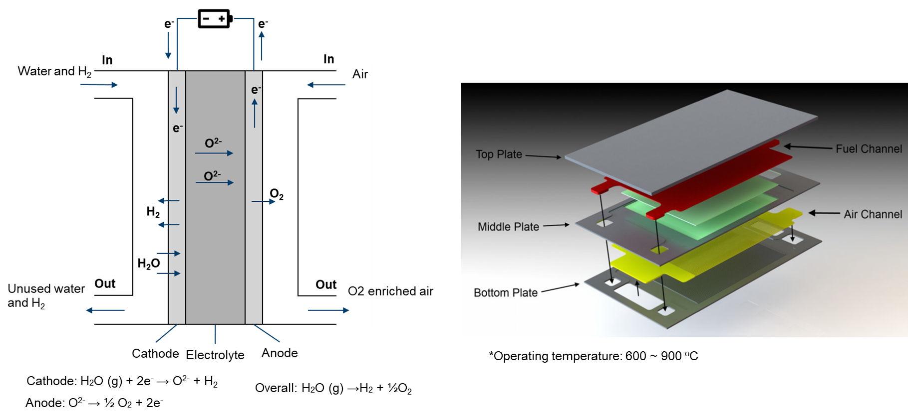

# Solid oxide electrolyzer

Solid oxide electrolyzer cells (SOECs) are a high-temperature electrolysis technology that produces hydrogen gas from water and electricity. They are highly efficient and can be powered by renewable energy sources, resulting in a smaller carbon footprint. SOECs can be used on a small or large scale for residential, commercial, industrial, and transportation applications. Challenges include reducing material and manufacturing costs, and improving durability and reliability. However, continued investment and innovation can make SOECs a major contributor to sustainable energy production.

<div align="center">
  
</div>

CFD modeling allows scientists and engineers to create detailed virtual representations of SOFCs, providing valuable insights into the interactions between gases, heat, and solid materials. This visualization aids in the design of effective flow patterns, fuel distribution, and heat management systems, ultimately improving the overall efficiency of the cell.

In modeling the physical processes within a SOEC, the following components and aspects are considered:

- main
  - Temperature distribution
- air (fluid)
  - Electrochemical reaction
  - Single-phase flow
  - Multicomponenet species
  - Temperature distribution (mapped from main)
- fuel (fluid)
  - Electrochemical reaction
  - Single-phase flow
  - Multicomponent species transfer
  - Temperature distribution (mapped from main)
- phiEC (electric)
  - Electron transfer
  - Temperature distribution (mapped from main)
- phiEA (electric)
  - Electron transfer
  - Temperature distribution (mapped from main)
- phiI (electric)
  - Ion transfer
  - Temperature distribution (mapped from main)
- electrolyte (solid)
  - Temperature distribution (mapped from main)
- interconnect (solid)
  - Temperature distribution (mapped from main)

```note
    In SOECs, the commonly used electrolyte is typically a ceramic material known as Yttria-Stabilized Zirconia (YSZ). Especially at high operating temperatures exceeding 600°C, YSZ serves as an efficient ion conductor.

    It's important to note that radiation plays a significant role in SOEC operations.
```

If you encounter difficulties with convergence:
- First, check the quality of your mesh.
- Adjust (decrease) the equation relaxation factors in fvSolution, for instance, in system/fuel/fvSolution.
- Tweak (decrease) the relaxation factors in constant/(air or fuel)/combustionProperties.
- Modify (decrease) the relaxation factors in constant/phiI/regionProperties.
- Make adjustments (decrease) to the relaxation factors in constant/phiEC/regionProperties.