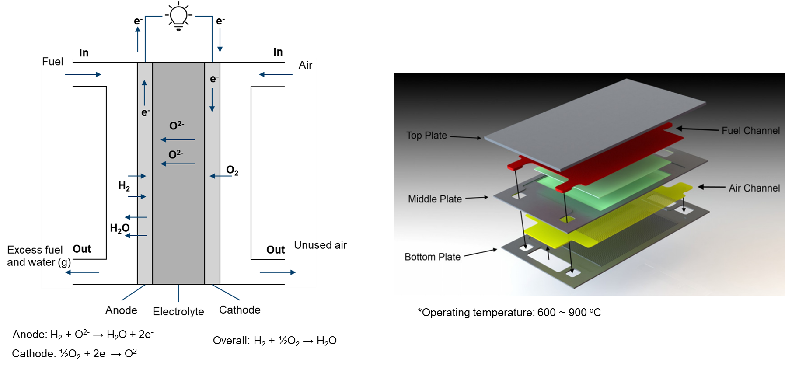

# Solid oxide fuel cell

Solid oxide fuel cells (SOFCs) are a highly efficient and versatile solution for clean energy generation. They convert up to 60% of fuel into electricity and can operate on a variety of fuels. They have low emissions and can be used in many applications, from powering homes and businesses to providing electricity in remote locations. However, SOFCs face challenges such as high cost and requiring careful maintenance. Ongoing research and development is making SOFCs more accessible and cost-effective, making them a technology to watch in the transition to a cleaner, more sustainable energy future.

<div align="center">
  
</div>

CFD modeling allows researchers and engineers to simulate and visualize the complex processes in SOFCs, offering insights into flow patterns, temperature distributions, and pressure variations within the electrolyzer. This information is invaluable for designing optimized cell and stack configurations that enhance performance and durability.

In modeling the physical processes within a SOFC, the following components and aspects are considered:

- main
  - Temperature distribution
- air (fluid)
  - Electrochemical reaction
  - Single-phase flow
  - Multicomponenet species
  - Temperature distribution (mapped from main)
- fuel (fluid)
  - Electrochemical reaction
  - Single-phase flow
  - Multicomponent species transfer
  - Temperature distribution (mapped from main)
- phiEC (electric)
  - Electron transfer
  - Temperature distribution (mapped from main)
- phiEA (electric)
  - Electron transfer
  - Temperature distribution (mapped from main)
- phiI (electric)
  - Ion transfer
  - Temperature distribution (mapped from main)
- electrolyte (solid)
  - Temperature distribution (mapped from main)
- interconnect (solid)
  - Temperature distribution (mapped from main)

```note
    In SOFCs, the commonly used electrolyte is a ceramic material known as Yttria-Stabilized Zirconia (YSZ). At high operating temperatures exceeding 600°C, YSZ serves as an efficient ion conductor, facilitating the electrochemical processes within the cell.

    It's worth noting that radiation can play a significant role in the operations of SOFCs, particularly at elevated temperatures.
```

If you encounter difficulties with convergence:
- First, check the quality of your mesh.
- Adjust (decrease) the equation relaxation factors in fvSolution, for instance, in system/fuel/fvSolution.
- Tweak (decrease) the relaxation factors in constant/(air or fuel)/combustionProperties.
- Modify (decrease) the relaxation factors in constant/phiI/regionProperties.
- Make adjustments (decrease) to the relaxation factors in constant/phiEC/regionProperties.